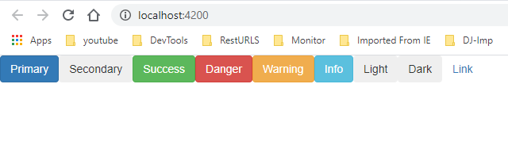

# angular-add-bootstrap

~~~
## Create a new application
ng new AngularDemo

## Add bootstrap to angular using command
yarn add bootstrap@3.3.7 --save

## add bootstrap to classpath inside angular.json
------------------
 "styles": [
              "src/styles.css",
              "node_modules/bootstrap/dist/css/bootstrap.min.css"
            ]

## Start the application
>ng s -o 

~~~
